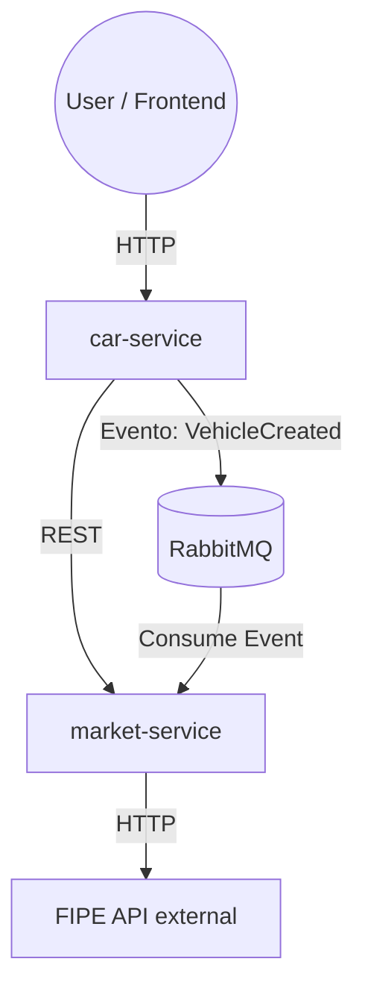

# LasanhaSpec
Um projeto mais intimista, mas que não deixa de ser ambicioso para todos aqueles que gostam de carros ou que querem aprender mais sobre eles.

É uma plataforma voltada mais  para entusiastas do mundo automotivo, das corridas e da preparação. 
Com foco em análise técnica de veículos, preparação automotiva e impacto de modificações de performance, consumo, custo e manutenabilidade.

O projeto nasceu da ideia do autor de sempre pensar nos carros como grandes legos/lasanhas alinhado ao prazer e curiosidade em programar coisas diferentes.
E como todo bom grande lasanheiro, quem não gostaria de um programa acessível de análise de performance baseado em valores e impactos reais que as modificações proporcionam para o seu possante, hein? haha

obs: por quê LasanhaSpec? bom, na comunidade gearhead de carros modificados, o carros são carinhosamente apelidados de lasanhas, pq como toda boa lasanha,, tem várias camadas(peças) e o cozinheiro(gearhead) se diverte montando haha.

 Sobre o Projeto

Lasanha Spec é uma plataforma voltada para entusiastas de carros usados e modificados, com foco inicial no mercado brasileiro.

O objetivo é centralizar conhecimento técnico, experiências reais e projetos automotivos em um único ambiente acessível, estruturado e confiável aplicar conceitos de:

### Backend

* Java
* Spring Boot
* Spring Data JPA
* Hibernate
* Banco relacional
* AWS S3 para imagens
* Microserviços

### Frontend (em desenvolvimento)

* React
* TypeScript
* Vite

---

Andei me informando sobre microserviços e percebi que não é todo projeto que se deve começar de cara com esse tipo de arquitetura de software, e que em muitos casos há a necessidade de maturar o projeto em um
monolitico bem estruturado e de acordo com a escalabilidade e necessidades do projeto, ir quebrando o sistema para uma nova concepção, mas como este projeto é mais como uma cobaia para fins didáticos e de diversão mesmo. Então o projeto segue uma abordagem baseada em microserviços, iniciando com um serviço central de veículos.

## 🧠 Arquitetura (em evolução)

Inicialmente o projeto nasceu como um monolito estruturado, mas está evoluindo para uma arquitetura baseada em serviços conforme novas necessidades surgem.

Hoje a separação está caminhando para:

- `car-service` → domínio principal (veículos, garagem, crônicos)
- `market-service` → dados externos (FIPE, preços, análise de mercado)

### Fluxo geral:

## 🇧🇷 Problema

O Brasil possui uma frota de veículos de passeio cada vez mais envelhecida, impulsionada pelo alto custo dos carros novos desde a pandemia.

Consequências:

* Crescente dependência de veículos antigos
* Manutenções complexas e caras
* Falhas recorrentes pouco documentadas
* Informação dispersa em fóruns e vídeos
* Alto risco para proprietários e compradores

Entusiastas frequentemente dependem de conhecimento informal para evitar prejuízos graves.

---

##  Proposta da Plataforma

Criar um hub que combine:

* Base de conhecimento técnica
* Rede social de projetos automotivos
* Garagem digital do usuário
* Documentação de problemas crônicos(eu considero essa feature o diferencial do meu projeto)
* Compartilhamento de builds e modificações

---

##  Público-Alvo

### Entusiastas hardcore

* Realizam modificações profundas
* Buscam dados técnicos
* Compartilham projetos

###  Donos apaixonados

* Gostam de um modelo específico
* Querem aprender mais
* Podem fazer upgrades leves

###  Usuários curiosos ou compradores

* Pesquisam antes de adquirir um veículo
* Precisam de informações rápidas e confiáveis

---

##  Funcionalidades do MVP

###  Garagem do Usuário

* Cadastro de veículos próprios
* Informações básicas e personalização
* Ativação/desativação

---

###  Setups / Builds

* Modificações atuais do veículo
* Versionamento de configurações
* Estatísticas básicas como cavalos, torque, kilometragem, potencial de preparação, infomações de KM/troca de óleo

---

###  Imagens do Veículo

* Upload para armazenamento na nuvem
* Múltiplas fotos por veículo
* Exibição tipo feed do instagram

---

###  Crônicos por Modelo

Base colaborativa de problemas recorrentes:

* Descrição do problema
* Sintomas
* Severidade
* Manutenção preventiva
* Estimativa de custo
* Votos de utilidade

---

###  Interação Social Básica

* Curtidas em fotos e builds
* Feed simples de atualizações

---

##  Objetivo do Projeto

Validar a utilidade da plataforma e construir uma base sólida para evolução futura, evitando complexidade prematura.

---

##  Status do Projeto

Em desenvolvimento ativo.

Funcionalidades core do backend já implementadas ou em progresso, incluindo:

* Modelagem de domínio
* Estrutura de APIs REST
* Integração com storage na nuvem

---

##  Visão de Longo Prazo

Transformar a plataforma em referência para:

* Conhecimento técnico automotivo colaborativo
* Comunidade de entusiastas
* Documentação de builds reais
* Prevenção de problemas mecânicos comuns

---

##  Autor

Projeto desenvolvido como iniciativa independente com foco em aprendizado prático e potencial de produto real, readme ainda em andamento tbm kkk

## Status das Funcionalidades

###  Implementado
- Cadastro e autenticação de usuários (JWT + Spring Security)
- Garagem do usuário (CRUD de veículos)
- Upload de imagens para AWS S3
- Catálogo de veículos base
- Problemas crônicos por modelo com sistema de votos

###  Em desenvolvimento
- Frontend (React + TypeScript)
- Feed social
- Setups da comunidade

  ----

- agora sim tive uma ideia interessante pra microserviço e que faça sentido com o rumo q a aplicação tá tomando, vou tentar integrar um serviço de disponibilidade de informações da tabela FIPE juntamente com um serviço de captura de informações de peças de carros, acho q vo ter q fazer algum tipo de scraping em sites de autopeças nacionais pra ter mais dados, tentar acessar as apis do mercado livre e ebay e tentar normalizar esses dados de forma consistente para serem servidos no meu projeto principal.

* Sobre a feture de consulta em apis de peças como do Mercado livre, ebay, eutoparts etc...

- Crônico aprovado → peças relacionadas → custo estimado de manutenção
- exemplo: Ford Fiesta 2004
  Crônico aprovado: bomba d’água com vazamento
  ↓
  Peças relacionadas:
- bomba d’água
- junta
- aditivo
- correia auxiliar
  ↓
  Preço médio no mercado